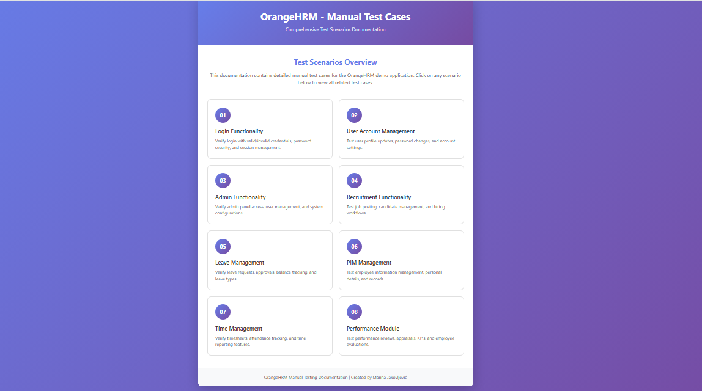

# OrangeHRM Test Cases (HTML/CSS)

This repository contains **manual test cases** for the OrangeHRM demo web application, implemented using **HTML and CSS**.  

The project is primarily focused on **QA manual test cases**, while also serving as practice for **frontend development**.  

The test cases include steps, expected results, and layout for easy viewing and reference. Some modules are not included, but the core functionalities are covered.  

## Features

✅ HTML structure created  
✅ CSS styling applied  
✅ Breadcrumb navigation implemented  

⚠️ Interactive elements (planned):  
- Expand/collapse sections  
- Filters for better navigation  

⚠️ Enhanced responsive design (planned):  
- Making pages look good on mobile and smaller screens  

## Test Cases Included

- Login functionality  
- User Account Management  
- Admin Functionality  
- Recruitment Functionality  
- Leave Management  
- PIM Management  
- Time Management  
- Performance Module  

## Screenshot

  

## How to Use

1. Clone this repository:  
   ```bash
   git clone https://github.com/MarinaInCodeLand/OrangeHRM-Test-Cases.git
    ```


2. Open `index.html` in your browser to access the main page.

2. Navigate through individual test case pages to see detailed steps, expected results, and layout.

3. *(Optional)* You can view it live at [GitHub Pages](https://marinaincodeland.github.io/OrangeHRM_TestCases/).


## Author

**Marina Jakovljević**  
- Email: jakov.marina@gmail.com  
- GitHub: [MarinaInCodeLand](https://github.com/MarinaInCodeLand)
